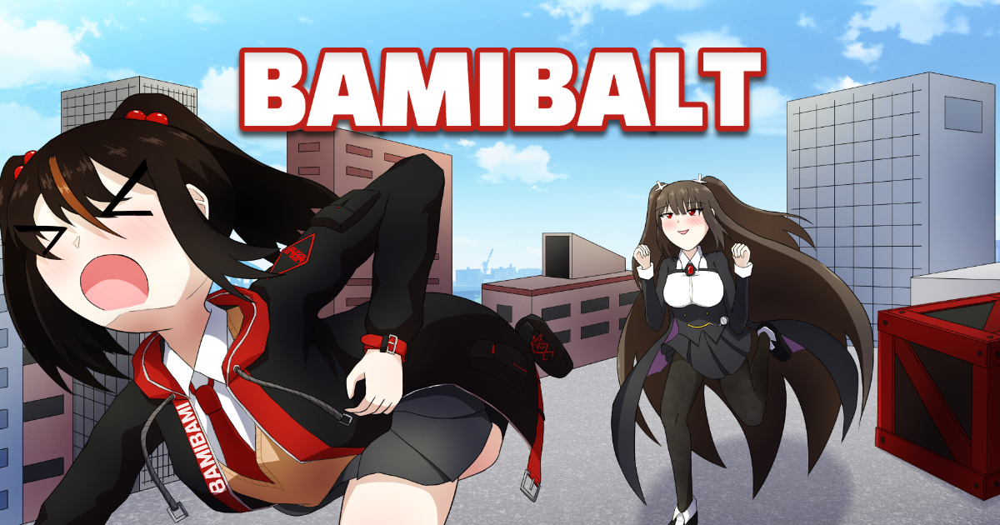

# [BAMIBALT](https://andrewpk95.github.io/Bamibalt/)

바미즈 세계관에서 폭주하는 유리에게 잡힐 위기에 처한 바미코! 그녀는 어디까지 멀리 도망칠 수 있을까요?

[CANABALT](http://canabalt.com/) 라는 무한 사이드 스크롤 러너 게임에 영감을 받아 제작된 **BAMIBALT**! [지금 플레이하세요!](https://andrewpk95.github.io/Bamibalt/)

본 게임은 제작자가 바미코를 너무나 사랑한 나머지 오너에게 생일선물에 맞춰 제작 및 출시했음을 알리며, **절대 다른 의도가 없었음을 맹세합니다.**

# 지원 환경

* **모바일, PC 웹 환경**
* **IE 빼고** 웬만한 최신 브라우저 다

# 정보

* 제작 기간: **6월 2일 ~ 6월 26일** (약 한 달)
* 웹 게임 엔진으로 오픈 소스 라이브러리 [Phaser](https://github.com/photonstorm/phaser)를 이용하여 제작
* 아트 리소스, 음악 리소스도 **순수 제작**
* 일부 효과음 순수 제작, 일부 효과음 CC0 라이선스의 [Freesound](https://freesound.org/) 를 변형하여 이용

# 저작권 (라이선스)

본 게임은 [@Nanju_Bami](https://twitter.com/Nanju_Bami), [@maze_wry](https://twitter.com/maze_wry), [@Glaciei_Candela](https://twitter.com/Glaciei_Candela) 님의 오리지널 캐릭터들로 제작되었습니다. 즉, **캐릭터들의 저작권은 각 분들께 있기 때문에**, 아트 리소스 및 캐릭터 디자인 등의 무단 도용을 금합니다. 

GitHub Pages 특성상 웹 페이지로 Publish 하려면 레포지토리를 공개해야 해서 소스 코드는 공개하나, 소스 코드는 아트 및 음악 리소스를 모두 대체한다는 조건 하에 수정 및 재배포 이용이 가능합니다. 단, **상업적 이용을 금합니다.**

수정 및 재배포를 원할 시, **반드시** 본 저작자 ([@andrewpk95](https://twitter.com/andrewpk95))에게 알리고 계시 시에 출처를 남기시길 바랍니다. 

# Credits
### 제작:
* 기획: rOn ([@andrewpk95](https://twitter.com/andrewpk95))
* 프로그래밍: rOn ([@andrewpk95](https://twitter.com/andrewpk95))
* 아트: rOn ([@andrewpk95](https://twitter.com/andrewpk95))
* 음악: rOn ([@andrewpk95](https://twitter.com/andrewpk95))

### 캐릭터:
* 바미코 (플레이어): [@Nanju_Bami](https://twitter.com/Nanju_Bami)
* 유리 (추적자): [@maze_wry](https://twitter.com/maze_wry)
* 에스텔 (비행기): [@Glaciei_Candela](https://twitter.com/Glaciei_Candela)

# 후기

여기까지 찾아와서 읽어주신 분들 정말 고맙습니다

저도 참 미쳤죠 누구의 생일을 위해서 이렇게까지 혼자 *선물*도 아니고, *축전*도 아니고, 무려 **게임 씩이나** 만들고 그죠 허허

 

게임 만들기로 딱 결정하고 개발기간을 딱 한 달 정도 잡고나니 (**심지어 회사도 다니는 몸이라**) 시간이 없을 것을 우려해 퀄리티 면에서 조금 타협한 감이 있지 않나 싶어요

그럼에도 불구하고 아트부터 음악까지 혼자 다 만들려다 보니 머리 아파 죽는 줄 알았습니다

이런 완벽한 1인 개발이 매우 꿈이지만 정말로 막상 1인 개발로 끝까지 하게 되면 생각지도 못했던 챙겨야할 것들이 참 많다는 것을 느끼게 되네요.

 

그리고 막상 이렇게까지 노력해도 결국은 금방 잊혀질 류의 간단한 미니게임을 만드는 거라 중간중간 고뇌도 참 많았습니다

그래서 게임이 인기 있을 거라는 관종 욕심은 조금 버리고, **"난 마음먹으면 이만큼까지 혼자 다 할 수 있는 대단한 사람이다!"** 라는걸 보여주는 정도로 생각하면서 작업하는게 맞았던 것 같기도 하네요 (뭐 제가 정말로 대단한 사람인지는 다른 사람들의 판단에 달린 거지만...)

 

아무튼 한 달 참 빨리도 순삭된 것 같습니다 오랫만에 열정을 들이부을 수 있는 기회(?)를 얻어서 기분도 좋았네요

앞으로도 열정적인 창작자의 모습 보여드릴 수 있도록 노력하겠습니다 (꾸벅)